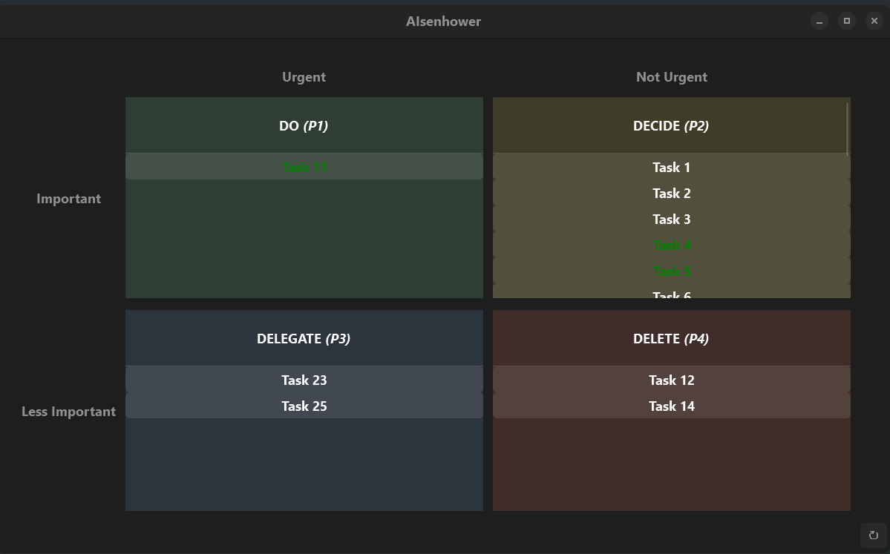

# AIsenhower
## Description
This Julia app displays all of a user's incomplete tasks from the AI planning website [Reclaim.ai](https://app.reclaim.ai), organizing them in an urgent-important matrix based on Reclaim's Priorities feature. Tasks with priorities 1-4 are displayed as follows:

  > Priority 1 - Urgent, Important 
  > Priority 2 - Not Urgent, but Important 
  >  Priority 3 - Urgent, but Not Important 
  > Priority 4 - Not Urgent, Not Important 

The app allows users to view and interact with their tasks in a succinct visual manner, making it easier to prioritize tasks and plan their day. This is especially useful for users who (like myself) have a large number of tasks on Reclaim and would like to view them all at once in a single window.

<!-- | AIsenhower (Light Mode) |:-:| AIsenhower (Dark Mode) |
|-------------------------|:-:|------------------------| -->
                 
  
## Usage Notes

- Before running the Julia script, obtain an API key from https://app.reclaim.ai/settings/developer and copy it into the `API_KEY` variable at the top of the script. Alternatively, you can copy the key into the terminal/REPL when prompted upon running the script.

- The `DARK_MODE` variable at the top of the script can be set to `true` or `false` depending on the user's preference.

- Run `julia <path_to_script_directory>/AIsenhower.jl` in the terminal or `include("<path_to_script_directory>/AIsenhower.jl")` in the Julia REPL to start the app. The script will stop running when the GUI window is closed.

- Tasks marked "Up Next" in Reclaim are displayed with a green text color on the matrix.

- Lists of tasks longer than their display box are scrollable.

- Clicking on a task will open the task in the default browser.

- Clicking the refresh symbol () at the bottom right of the app reloads the tasks from the Reclaim API.

## Credits

  - The [Julia Programming Language](https://julialang.org/) for the language and package manager.
  - [Reclaim.ai](https://app.reclaim.ai) for the API to access tasks.
  - [Mousetrap.jl](https://github.com/Clemapfel/mousetrap.jl) for the GUI engine.

---
To ask questions or provide comments regarding this application, navigate to this GitHub repo's Discussion page or email [jscott19@alum.mit.edu](mailto:jscott19@alum.mit.edu). For feature requests or bug reports, feel free to create an issue on the GitHub repo's Issues page.